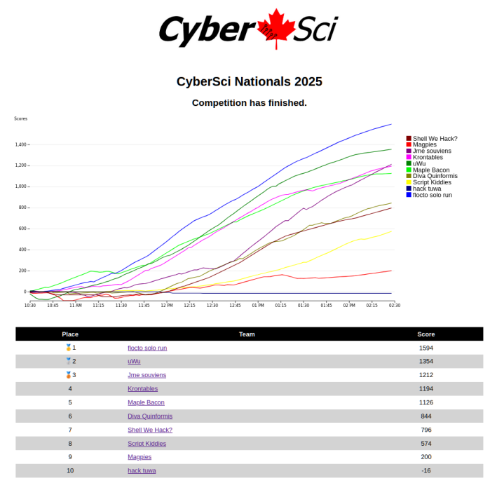
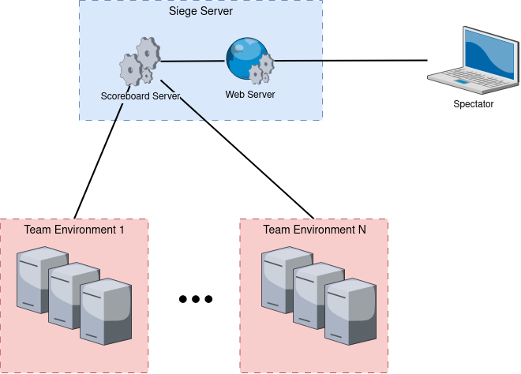
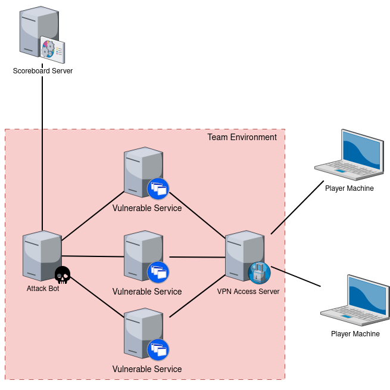
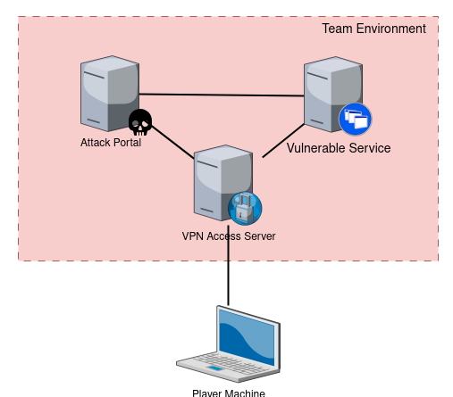
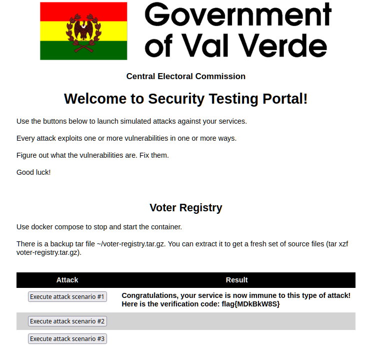

# Siege - Defense Competition Framework

## Description

Siege is a software framework for hosting defense-style cybersecurity competitions. It was built for testing and practicing blue-team skills of anyone charged with building secure software and protecting the enterprise: cybersecurity specialists, software engineers, testers, IT engineers.

During the competition teams of players are given access to a set of vulnerable services implemented using a variety of progamming languages, protocols, environments and frameworks. Services receive a continuous stream of benign and malicious requests from autonomous bot processes. Successful benign requests are awarded points on the global scoreboard, while successful malicious requests result in point subtraction.

The goal is to indentify and fix as many vulnerabilities as possible and as quickly as possible. The team with the highest amount of points wins.

## Architecture

Siege environment consists of the following major parts:

### Scoreboard server

Scoreboard keeps track of team points and records progress during the competition. It orchestrates communication between other components in the system and presents a web site with dynamic progress graph and score changes at every step in the competition.

### Team subnet

Every team receives access to a virtual subnet, each containing several virtual machines. Teams have exclusive access to their own subnet but cannot see or interfere with other teams' resources.

### Vulnerable services

Each subnet has one or more virtual machines that host vulnerable services. Vulnerabilities can be in implementation, software dependencies, configuration. Players have full ownrship of these machines and are allowed to do anything to make them secure.

### Attack bot

One machine on the subnet is an attack bot. It is off limits to the players. It is responsible for sending requests to vulnerable services, and keeping track of team's progress. It reports team's results to the scoreboard server.

## Siege Light

Running a live competition with a scoreboard server may be a significant undertaking. We provide an alternative way to run Siege - **Siege Light**.

In this setup players also have ther own 
team environments but they are self-contained, there is no scoreboard server to set up and no time limit in the competition.

Players proceed at their own pace and have control over the attacks. They have an **Attack Portal** - a website from which they intiate requests against their vulnerable services.

The rest of the workflow is similar to the original competition - you need to analyze traffic, discover vulnerabilities and fix them. Once the portal detects that the attack is not working any more it rewards player with a *flag* that proves that they fixed the problem. If desired, flags can then be entered into some external leaderboard, e.g. one hosted on [CTFd](https://ctfd.io/). 

## Setting up a competition

***We are completing [a set of scripts](./infra) that automate provisioning of competition environments. Stay tuned.***

## Vulnerable service development

Developing vulnerable services (also called *challenges*) is the most complex (and, arguably, the most interesting and creative) part of the competition. You need a combination of software development and offensive security skills to do such work. 

Not only you need to develop a new application, but you also need to come up with non-trivial vulnerabilities that to introduce into the code, and also need to develop attack scripts that will exercise both intended and vulnerable functionality in a robust way.

We provide a set of [example challenges](example_competition) for you to study and use as a jumping-off point for your own development.

## Future work

We are considering support for the following features next:

* GUI for competition configuration and management
* Support for a production-quality WSGI server like Gunicorn
* Isolation for attacker scripts (so that problems in one attacker would not affect execution of others)
* AWS support for competition environment
* Adding an option to host some of the infrastructure in containers
* ...and more

## Contributing

We welcome questions, ideas, bug fixes and new features. 

* To communicate with us, please log an issue and tag it appropriately.

* If you are submitting *a small bug fix or change*, please make sure that it follows the code style, passes checks and tests, is well documented and that new unit test(s) are added.

* Before submitting *a new feature* please first discuss it with us by logging an enhancement issue. We want to make sure that any new functionality fits well into our plans for the tool's architecture and capabilities.

## Acknowledgements

Many thanks to the following people for their ideas and time that helped improve this software: [HapiRat](https://github.com/HapiRat), [jacksimple](https://github.com/jacksimple), [Fen-nix](https://github.com/Fen-nix), [trentholmes](https://github.com/trentholmes), [willemgooderham](https://github.com/willemgooderham), [iamsilk](https://github.com/iamsilk), [ApprenticeofEnder](https://github.com/ApprenticeofEnder), [crazyeights225](https://github.com/crazyeights225)
